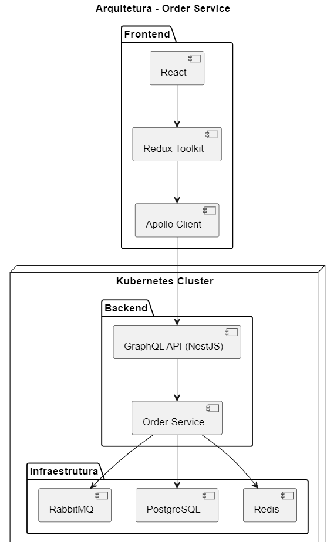

# 📦 Order Service – PlantUML

Este repositório contém a implementação parcial de um **Order Service** utilizando **Node.js (NestJS)**, **GraphQL**, **PostgreSQL**, **Redis** e um **diagrama de arquitetura em PlantUML**, conforme solicitado no teste técnico.

O foco do projeto é **demonstrar entendimento de arquitetura, integração entre camadas e boas práticas**, e não uma solução produtiva completa.

## 🧩 Arquitetura

A arquitetura foi modelada utilizando um **diagrama de componentes em PlantUML**, representando a integração entre:

- **Frontend:** React + Redux Toolkit + Apollo Client  
- **Backend:** NestJS + GraphQL  
- **Persistência:** PostgreSQL  
- **Cache:** Redis  
- **Mensageria:** RabbitMQ  
- **Orquestração:** Kubernetes  

### Diagrama de Arquitetura

O arquivo fonte do diagrama está disponível em: /architecture.puml

1. Instale a extensão **PlantUML** no VS Code  
2. Abra o arquivo:  /architecture.puml
3. Pressione: Ctrl + Shift + P
4. Selecione: PlantUML: Preview Current Diagram

