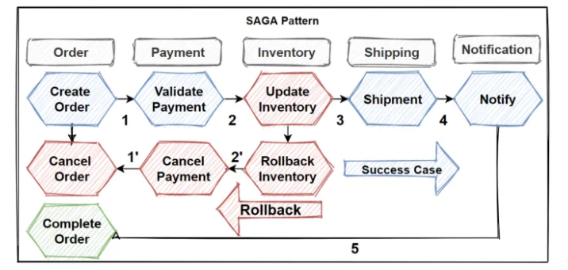

## Imagem 

O fluxo principal (linha azul) é:
Create Order
Validate Payment
Update Inventory
Shipment
Notify

## Explicação 

O fluxo se inicia com a criação de um pedido pelo usuário. após a criação do pedido o serviço manda um evento dizendo que um novo pedido foi criado, o serviço de pagamento consome  esse evento pra poder realizar a validação do pagamento

no caso se o pagamento for aprovado um novo evento é publicado, e é consumido pelo serviço do estoque e entao realiza a separação do item , e isso vai garantir que o item(produto) fique indisponivel para outras transações durante o processamento desse pedido.

Após a reserva do estoque, os serviços subsequentes (como envio ou notificação) podem ser executados. Se todas as etapas forem concluídas com sucesso, o pedido é marcado como concluído.

Se ocorrer qualquer falha durante o processo ou o usuário solicite o cancelamento da transação, o fluxo de compensação é iniciado. O serviço de pedidos publica um evento de cancelamento, que é consumido pelos demais serviços envolvidos na saga.

Ao receber o evento de cancelamento, o serviço de pagamento executa a ação compensatória realizando o estorno do valor pago. Em seguida, o serviço de estoque executa sua ação compensatória, liberando os itens reservados e retornando-os ao estoque disponível.

Após a execução das ações compensatórias, o serviço de pedidos atualiza o status do pedido para cancelado e notifica o cliente sobre a conclusão do cancelamento. Todo o processo é baseado em comunicação assíncrona por eventos, garantindo consistência eventual sem a necessidade de transações distribuídas.

